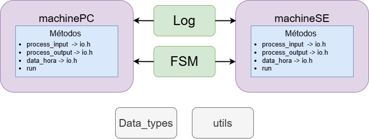

# EEL7323-SE-PROVA1

Este repositório contém a implementação de uma máquina de refrigerantes que pode ser executada tanto em um ambiente desktop quanto em um sistema microprocessado embarcado.

## Diagrama do projeto



O projeto é estruturado em duas classes principais: machinePC, que será executada em um desktop, e machineSE, projetada para um sistema embarcado. Ambas as classes herdam classes abstratas responsáveis pela entrada e saída de dados, bem como pela exibição da data e hora. Cada uma delas implementa o método run, que contém um loop infinito while(1), responsável por iniciar o funcionamento da máquina de refrigerantes.

Tanto a classe machinePC quanto a machineSE utilizam os objetos Log e FSM, sendo o primeiro responsável pelo sistema de log da máquina e o segundo pela implementação da máquina de estados. Vale ressaltar que a funcionalidade de log depende de duas classes auxiliares: Nodo e Queue, que gerenciam a estrutura de dados utilizada para armazenar os registros de log.

Além disso, o projeto faz uso de dois arquivos utilitários que são empregados em várias partes do código. O primeiro é o utils.h, que contém funções de controle de tempo, como o delay. O segundo é o data_types.h, que define as estruturas e tipos de dados utilizados na implementação da máquina de refrigerantes.

## Funcionalidades

A máquina de refrigerantes simula o funcionamento básico de uma vending machine que aceita moedas de diferentes valores e realiza a entrega de produtos. A implementação inclui:

- **Operação em Desktop**: Controle por teclado e exibição de saídas no console.
- **Operação em Sistema Embarcado**: Utilização de botões e switches como entrada e LEDs como saída.

## Estrutura do Projeto

- **src/**: Contém os arquivos `.cpp` com a implementação das classes e funções principais.
- **include/**: Contém os arquivos de cabeçalho `.h`.
- **main.cpp**: Arquivo principal que executa o programa.
  
## Compilação e Execução no Desktop

Para compilar o código no ambiente desktop, siga os comandos abaixo:

```bash
g++ -Iinclude -o my_program main.cpp src/*.cpp

## Para executar o programa

```bash
.\my_program
